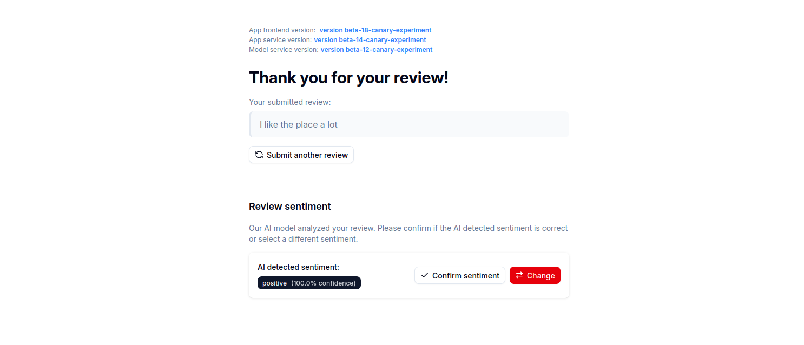
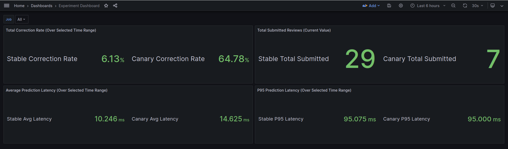

# Continuous Experimentation: Impact of Displaying Model Confidence Scores on User Corrections

**Services Involved:** `app-frontend`, `app-service`, `model-service` (both `stable` and `canary` versions)


## 1. Introduction and Experiment Rationale

Our application allows users to submit reviews for restaurants. A core feature involves our `model-service` classifying these reviews as either positive or negative. This prediction, an integer value representing the sentiment, is processed by the `app-service` and then presented to the user in the `app-frontend` (as "positive" or "negative"). Users currently have the ability to manually correct this prediction if they feel it doesn't align with their intended sentiment.

We are investigating a potential enhancement: displaying the confidence score associated with the model's prediction. The underlying sentiment prediction model itself will **not** be changed for this experiment. Our goal is to determine if providing this additional piece of information to the user influences their tendency to make manual corrections.

This document outlines the experiment designed to test this feature.

## 2. The Base Experience (Control Group - `stable` version)

The current, established user experience is served by the `stable` versions of our services:

1.  A user submits a restaurant review text via the `app-frontend-stable`.
2.  The `app-frontend-stable` sends this text to the `app-service-stable`.
3.  The `app-service-stable` forwards the request to the `model-service-stable`.
4.  The `model-service-stable` (using our existing, unchanged sentiment analysis model) predicts the sentiment and returns it as an integer (e.g., `0` for negative, `1` for positive) along with any other standard data, but **no confidence score is exposed**.
5.  The `app-service-stable` relays this integer sentiment prediction back to the `app-frontend-stable`.
6.  The `app-frontend-stable` interprets the integer (e.g., `0` -> "negative", `1` -> "positive") and displays the predicted sentiment to the user.
7.  If the user disagrees with the displayed prediction, they can use an interface element to correct it. Each correction is logged.

Users routed to this `stable` stack will form the **control group** for our experiment and will not see any confidence scores.

## 3. The New Feature: Introducing Confidence Scores (Experimental Group - `canary` version)

For this experiment, we are deploying `canary` versions of our services. These versions are identical to their `stable` counterparts except for the handling and display of model confidence scores. The core sentiment prediction logic of the `model-service` remains unchanged.

The modifications are as follows:

*   **`model-service-canary`:**
    *   **Change:** While still returning the sentiment as an integer, this version has been updated to also return the confidence score (a float, e.g., `0.0` to `1.0`) associated with that prediction. For example, the response might be `{"prediction": 1, "prediction_confidence": 0.92}`.

*   **`app-service-canary`:**
    *   **Change:** This service has been updated to receive both the integer sentiment and the confidence score from `model-service-canary`. It then passes both pieces of information in its API response to `app-frontend-canary`.

*   **`app-frontend-canary`:**
    *   **Change:** This version is modified to receive and parse the confidence score from the `app-service-canary` response. It will still interpret the sentiment integer into a human-readable string (e.g., "positive," "negative") but will now also display the confidence score. For instance, a user might see: "positive (92% confidence)".

Users routed to this `canary` stack via Istio's traffic management will form our **experimental group**.

The image below presents an example of the UI of the new feature in the app-frontend:



## 4. Hypothesis

We propose the following falsifiable hypothesis:

*   **Primary Hypothesis (H1):** *Displaying the model's confidence score will lead to an **increase** in the overall rate of manual corrections made by users. This is anticipated because transparency into the model's certainty (especially when low) will empower users to correct predictions they perceive as inaccurate or weakly supported, which they might have otherwise let pass.*
    *   **Rationale:** When users see that the model itself is not highly confident in a prediction (e.g., "Positive, 60% confidence"), and this prediction mismatches their own assessment, they may feel more justified or encouraged to make a correction. While high-confidence scores might deter some corrections, we suspect the effect of low-confidence scores encouraging corrections will be more dominant, leading to a net increase. This could ultimately improve the quality of user-validated data.

*   **Null Hypothesis (H0):** *Displaying the confidence score will have no significant impact on the overall rate of user-initiated manual corrections.*

## 5. Metrics for Evaluation

To test our hypothesis and monitor system health, the following key application-specific metrics will be utilized. These metrics will be scraped using Prometheus and are labeld with a `version_label` (`stable` or `canary`) to differentiate between the two deployed versions.

### 5.1. Primary Experimental Metrics

These metrics directly inform the outcome of the experiment regarding user correction behavior.

1.  **`overrides_by_user_total` (Counter):**
    *   **Description:** Increments each time a user manually corrects a sentiment prediction.
    *   **Labels:** `version_label`, `original_label`, `corrected_label`.
    *   **Purpose:** Serves as the numerator for the correction rate.

2.  **`reviews_submitted_total` (Counter):**
    *   **Description:** Increments for each new review submitted for sentiment analysis.
    *   **Labels:** `version_label`.
    *   **Purpose:** Serves as the denominator for the correction rate, representing total prediction opportunities.

3.  **`Total Correction Rate` (Calculated):**
    *   **Description:** Represents the proportion of submitted reviews that were manually corrected. It is calculated as (Total Overrides / Total Submitted Reviews) for each version over the experiment's observation period.
    *   **Purpose:** The key comparative metric to assess differences in user correction behavior between `stable` and `canary` versions.

### 5.2. Secondary (Guardrail) Metrics

These metrics monitor the health and performance of the application versions.

1.  **`predictions_latency_seconds`:**
    *   **Description:** Measures the duration of model prediction calls.
    *   **Labels:** `version_label`.
    *   **Purpose:** Used to derive:
        *   **Average Prediction Latency:** The mean time taken for predictions.
        *   **P95 Prediction Latency:** The 95th percentile of prediction times, indicating worst-case latency for most requests.
        These help ensure the experimental feature does not negatively impact performance.


## 6. Experiment Setup & Traffic Management

*   **Canary Deployment:** The `canary` versions of `app-frontend`, `app-service`, and `model-service` will be deployed alongside their `stable` counterparts. Image tags for these canary deployments will be `:canary`, managed via our "Canary Feature Deployment" CI/CD pipeline that can be manually triggered in GitHub Action on a feature branch. The specific canary branches containing the confidence score feature are:
    *   **app-frontend:** `18-canary-experiment`
    *   **app-service:** `14-canary-experiment`
    *   **model-service:** `12-canary-experiment`
    
    Crucially, the `stable` and `canary` deployments for `app-service` will be configured with a distinct environment variable, `APP_VERSION_LABEL` (set to "stable" or "canary" respectively). This environment variable is used within the application to label the emitted metrics, allowing for clear differentiation of  metrics picked up by Prometheus.

*   **Traffic Splitting:** We will use Istio to manage traffic. Initially, a small percentage of user traffic (e.g., 10%) will be directed to the `canary` stack, while the remaining 90% will continue to use the `stable` stack. This will be configured using Istio `VirtualService` and `DestinationRule` resources for each of the three services (`app-frontend`, `app-service`, `model-service`) to ensure consistent routing (i.e., a user hitting `app-frontend-canary` will use `app-service-canary` and `model-service-canary`).

*   **Sticky Sessions:** To ensure a consistent user experience and the integrity of our experimental data, we've implemented a multi-layered approach to session consistency across the service stack:

    1. **Frontend Routing (Cookie-based):**
       *   If a request has a cookie `{{ .Release.Name }}-app-version=stable`, it's routed to the `stable` `app-frontend` subset.
       *   If a request has a cookie `{{ .Release.Name }}-app-version=canary`, it's routed to the `canary` `app-frontend` subset.
       *   For new users without this cookie, the `VirtualService` routes them based on defined weights (e.g., 90% stable, 10% canary) and adds a `Set-Cookie` header to establish persistence.
       *   **Testing Specific Versions:** To manually test a specific frontend version, set the cookie `app-version=stable` or `app-version=canary` in your browser (replace "my-app" with your actual release name).

    2. **Backend Routing (Header-based):**
       *   The `app-service` routing is based on an `X-App-Version` header rather than cookies.
       *   When the `app-frontend` makes requests to the `app-service`, it sets the `X-App-Version` header based on the cookie value it received.
       *   This header-based approach was necessary because browser requests don't automatically forward cookies across different domains/services.
       *   Direct API consumers (e.g., Postman) can achieve sticky sessions for the backend by consistently using the same `X-App-Version` header in their requests.
       *   **Testing Specific Versions:** To target a specific app-service version directly, add the header `X-App-Version: stable` or `X-App-Version: canary` to your API requests.

    3. **Model Service Routing:**
       *   The `model-service` is internal and only accessible from within the cluster by the `app-service`.
       *   It identifies the source version by examining the version from the `app-service`.
       *   This ensures that `app-service-stable` connects to `model-service-stable` and `app-service-canary` connects to `model-service-canary`.

## 7. Data Collection & Monitoring

*   **Prometheus:** Our Kubernetes cluster's Prometheus instance will scrape the metrics detailed above.
*   **Grafana:** A dedicated Grafana dashboard will be created.

## 8. Decision Process

### Experiment Duration and Completion Criteria
The experiment will run until one of the following conditions is met:
- A minimum of 200 reviews have been submitted through the canary version, providing sufficient statistical power for comparison
- A maximum of 4 weeks have elapsed since the experiment start date, ensuring timely decision-making regardless of traffic volume

### Evaluation Framework and Success Criteria
We will evaluate our primary hypothesis (H1) using specific quantitative thresholds. These thresholds can all be obtained from the Grafana dashboard, described in section 9:

1. **Primary Metric - Correction Rate:**
   - We will accept H1 if the correction rate in the canary version increases by at least 10% compared to the stable version
   - This threshold represents a meaningful change in user behavior that justifies the implementation effort
   - The calculation will compare (total overrides / total reviews) between versions over the full experiment period

2. **Guardrail Metrics - Performance Impact:**
   - Average prediction latency must not increase by 5% or more in the canary version
   - P95 prediction latency must not increase by 5% or more in the canary version
   - These thresholds protect against user experience degradation due to performance issues

### Decision Matrix and Outcomes

1. **Full Rollout (Success Case):**
   - **Criteria Met:** 
     - Correction rate increases by 10% or more
     - Both latency metrics remain within acceptable thresholds (<5% increase)
   - **Interpretation:** The confidence score feature successfully encourages appropriate user corrections without compromising performance
   - **Action:** Proceed with full rollout to all users and incorporate the feature into the stable version

2. **Further Evaluation Required (Mixed Results):**
   - **Criteria Met:** 
     - Correction rate increases by 10% or more
     - BUT one or both latency metrics exceed thresholds (≥5% increase)
   - **Interpretation:** The feature shows promise but may need optimization
   - **Action:** Conduct team review to determine if the benefits outweigh performance costs, or if optimization is needed before rollout

3. **Rollback (Failure Case):**
   - **Criteria Met:**
     - Correction rate increases by less than 10% or decreases
     - OR critical performance degradation observed beyond acceptable thresholds
   - **Interpretation:** The feature does not provide sufficient benefit or causes unacceptable performance issues
   - **Action:** Revert to stable version only.

### Monitoring and Evaluation Schedule
- **First 48 hours:** Daily monitoring of system stability and initial metrics
- **Weekly reviews:** Review of metrics and trends
- **Final analysis:** Comprehensive review of all metrics at experiment completion


## 9. Grafana Dashboard Visualization

A Grafana dashboard will be central. The dashboard can be found in Grafana under the name "Experiment Dashboard". The corresponding json file can be found in the helm chart with path "grafana-dashboards/experiment-dashboard.json". This is a visualization of the dashboard:



---

The dashboard includes the following key "Stat" panels, each displaying separate values for the `stable` and `canary` versions:

1.  **Total Correction Rate (Over Selected Time Range):**
    *   **Visualization Type:** Stat Panel
    *   **Description:** This is the primary experimental metric. It displays the overall proportion of submitted reviews that were manually corrected by users for both the `stable` and `canary` versions. This rate is calculated over the time range currently selected in Grafana.
    *   **PromQL Query (Conceptual for Stable):**
        ```promql
        sum(increase(overrides_by_user_total{job=~"$job", version_label="stable"}[$__range]))
        /
        sum(increase(reviews_submitted_total{job=~"$job", version_label="stable"}[$__range]))
        ```
        (A similar query is used for the `canary` version.)
    *   **Unit:** Percentage (e.g., 5.25%)
    *   **Purpose:** To directly compare the aggregate correction behavior between the two versions.

2.  **Total Submitted Reviews (Current Value):**
    *   **Visualization Type:** Stat Panel
    *   **Description:** Shows the current total count of reviews submitted and processed by the `stable` version and the `canary` version since each respective metric instance was last reset (typically since the pod started).
    *   **PromQL Query (Conceptual for Stable):**
        ```promql
        sum(reviews_submitted_total{job=~"$job", version_label="stable"})
        ```
        (A similar query is used for the `canary` version.)
    *   **Unit:** Raw count (e.g., 1.2K)
    *   **Purpose:** To provide context on traffic volume for each version and act as the denominator for the correction rate.

3.  **Average Prediction Latency (Over Selected Time Range):**
    *   **Visualization Type:** Stat Panel
    *   **Description:** Displays the average latency for model predictions for both the `stable` and `canary` versions, calculated over the selected Grafana time range.
    *   **PromQL Query (Conceptual for Stable):**
        ```promql
        sum(rate(predictions_latency_seconds_sum{job=~"$job", version_label="stable"}[$__range]))
        /
        sum(rate(predictions_latency_seconds_count{job=~"$job", version_label="stable"}[$__range]))
        ```
        (A similar query is used for the `canary` version.)
    *   **Unit:** Seconds (e.g., 0.350s)
    *   **Purpose:** Guardrail metric to monitor average performance impact.

4.  **P95 Prediction Latency (Over Selected Time Range):**
    *   **Visualization Type:** Stat Panel
    *   **Description:** Displays the 95th percentile for model prediction latency for both the `stable` and `canary` versions, calculated over the selected Grafana time range.
    *   **PromQL Query (Conceptual for Stable):**
        ```promql
        histogram_quantile(0.95, sum(rate(predictions_latency_seconds_bucket{job=~"$job", version_label="stable"}[$__range])) by (le, version_label))
        ```
        (A similar query is used for the `canary` version.)
    *   **Unit:** Seconds (e.g., 0.820s)
    *   **Purpose:** Guardrail metric to monitor worst-case performance impact for the majority of users.

---


## 10. Conclusion and Next Steps

This experiment aims to understand how displaying model confidence scores affects user engagement with our sentiment correction feature. By testing the hypothesis that this transparency will lead to more active (and potentially more numerous) corrections, especially for less certain predictions, we hope to gather insights that can improve both user experience and the quality of feedback data.