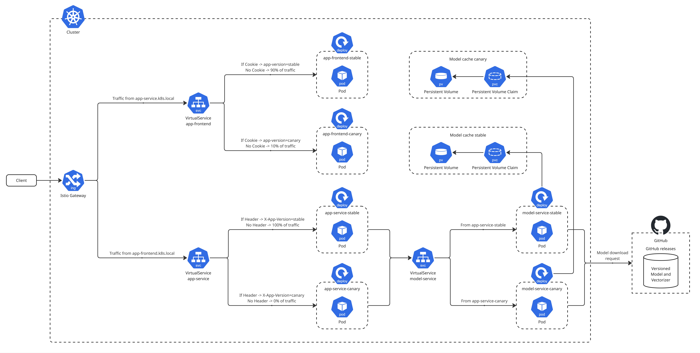
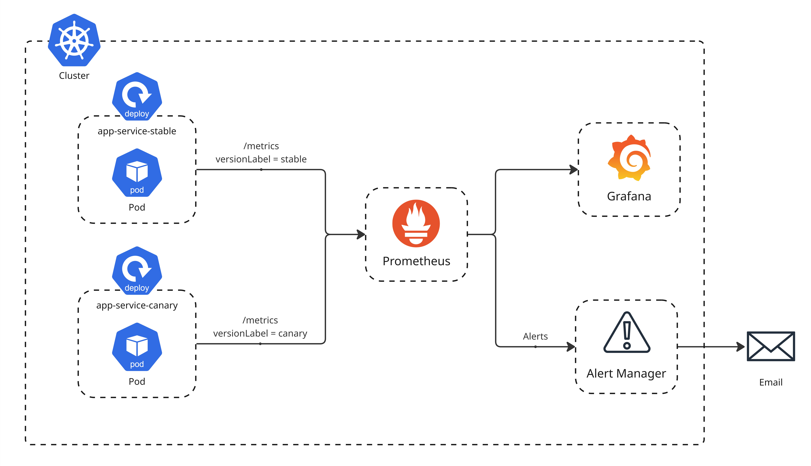

# Deployment Structure and Data Flow

This document provides a conceptual overview of our deployment architecture and data flow, focusing on the Kubernetes and Istio-based setup. It is intended to help new contributors quickly understand the system's structure, the roles of its components, and how requests flow through the cluster. The document includes two complementary visualizations: one focusing on the monitoring infrastructure deployment and another illustrating the complete request flow and traffic routing. For implementation details, see the [operation repository](https://github.com/remla2025-team9/operation).

---

## 1. **High-Level Architecture**

Our deployment consists of three main application components, monitoring infrastructure, and supporting Kubernetes/Istio resources. The following two visualizations provide comprehensive views of all deployed components and their interactions.

---

## 2. **Deployment Visualizations**

### **2.1 Complete Request Flow and Traffic Routing**

This diagram illustrates the complete request flow and dynamic routing behavior within our Kubernetes cluster. The visualization demonstrates how traffic moves through the system and how version consistency is maintained across all services. This comprehensive view shows all deployed resources including application services, service mesh components, storage, and external dependencies.

### **2.2 Monitoring Stack Infrastructure (Zoomed View)**

This visualization provides a focused view of the monitoring infrastructure deployed within the same Kubernetes cluster shown above. It shows how observability components are integrated with the core application services to provide comprehensive monitoring, alerting, and visualization capabilities. This is essentially a zoomed-in view of the monitoring components that operate alongside the application services in the main deployment diagram.

---

## 3. **Infrastructure Components & Architecture**

Our production deployment integrates application services, Kubernetes orchestration, and Istio service mesh components as shown in both visualizations above (Sections 2.1 and 2.2). This section provides a comprehensive overview of all deployed components and their roles.

### **Application Services**
- **App Frontend**: User-facing web application handling sentiment analysis interface and user interactions.
- **App Service**: Backend API that mediates between frontend and model, implementing business logic and request orchestration.
- **Model Service**: Serves ML model predictions with automatic model versioning and performance optimization.

### **Kubernetes Infrastructure**
- **Deployments**: Each service (frontend, backend, model) is deployed as a Kubernetes Deployment, supporting multiple versions for experiments.
    - To enable canary deployments, we deploy one Deployment resource for each version and use labels to differentiate versions (e.g., `app=app-frontend, version=stable` and `app=app-frontend, version=canary`).
- **Services**: Kubernetes Services expose each Deployment internally in the cluster with automatic endpoint management and health checking.
- **PersistentVolumes**: Provide high-performance storage for model cache, ensuring model artifacts persist across pod restarts (visible in the main deployment diagram).
- **PersistentVolumeClaims**: Bind to PersistentVolumes to provide storage access to model service pods.
- **Secrets**: A secret has been added to the app-service for storing sensitive configuration such as API keys and database credentials.
- **ConfigMaps**: All services include a ConfigMap for managing their environment-specific configuration, feature flags, and non-sensitive settings.

### **Service Mesh Components**
The service mesh components shown in the main deployment visualization (Section 2.1) provide intelligent traffic management:

- **Istio Gateway**: Entry point for all external HTTP traffic with SSL termination and security policies.
- **VirtualServices**: Define sophisticated routing rules for HTTP traffic:
    - **Frontend routing**: Routes requests to specific service versions (by default, 90% to stable, 10% to canary when no cookie is present), using cookie-based routing to ensure user sessions are sticky to a specific version.
    - **Backend routing**: Routes requests based on `X-App-Version` headers sent by the browser, defaulting to stable version when no header is present.
- **DestinationRules**: Define subsets for each service, enabling version-based routing, sticky sessions, and circuit breaker patterns:
    - **Subsets**: Each service has `stable` and `canary` subsets defined by version labels, allowing precise traffic targeting.
- **EnvoyFilters**: Enforce rate limiting policies and security controls at the gateway level.

### **Monitoring Stack**
Our observability infrastructure (detailed in Section 2.2) operates as a first-class citizen in the cluster:

- **Prometheus Stack**: 
    - **Prometheus Server**: Central metrics collection and storage engine for both infrastructure and application metrics.
    - **ServiceMonitors**: Automatically discover and configure scraping of application metrics from all services.
    - **PrometheusRules**: Define alerting rules for performance regression detection and operational monitoring.
- **Grafana**: Visualizes metrics through custom dashboards configured via ConfigMaps, providing real-time insights for experiment analysis and system health.
- **AlertManager**: Handles alert routing, grouping, and notification with integration to team communication channels for critical system events.

This integrated architecture enables seamless experimentation while maintaining production reliability, with each component designed to support our continuous deployment and testing strategies.

---

## 4. **Request Flow Analysis**

Referring to the complete deployment visualization (Section 2.1), the request flow follows these patterns:

### **Key Components Shown:**

1. **External Entry Point**: The client initiates requests that enter through the Istio Gateway
2. **VirtualServices**: Each service tier has its own VirtualService that implements intelligent routing logic
3. **Version-Specific Pods**: Each service (app-frontend, app-service, model-service) has both stable and canary versions deployed
4. **External Dependencies**: The model service connects to GitHub for model downloads and versioning

### **External Request Flow**

1. **User Request**: A user accesses the frontend via a DNS name (`app-frontend.k8s.local`).
2. **Gateway**: The request enters the cluster through the Istio Gateway.
3. **Frontend VirtualService Routing**: 
   - If the request contains a version cookie (e.g., `app-version=stable` or `app-version=canary`), Istio routes directly to the corresponding frontend version.
   - If no version cookie is present, Istio splits traffic between versions (90% to stable, 10% to canary) and sets a version cookie in the response to establish session persistence.
4. **Browser-Mediated Backend Communication**: When the frontend application (running in the user's browser) needs to communicate with the backend API (`app-service`), the browser initiates separate HTTP requests to `app-service.k8s.local`. The frontend JavaScript extracts the version from the previously set cookie and adds it as an `X-App-Version` header to these backend requests.
5. **Backend VirtualService Routing**:
   - If the request contains an `X-App-Version` header with `stable` or `canary`, Istio routes to the corresponding backend version.
   - If no `X-App-Version` header is present, Istio defaults to routing to the stable version (design choice for reliability).
6. **Backend to Model**: The backend calls the model service for predictions via internal cluster communication, ensuring version consistency through sophisticated routing logic. The model service VirtualService examines the source of incoming requests to determine which app-service version initiated the call, then routes to the corresponding model service version (e.g., requests from `app-service-stable` are routed to `model-service-stable`, while requests from `app-service-canary` are routed to `model-service-canary`). This ensures complete version stack consistency throughout the request chain.
7. **Response Propagation**: The response flows back through the same path to the user's browser.

### **Dynamic Traffic Routing Analysis**

**Frontend Routing Logic:**
- When a user first accesses `app-frontend.k8s.local`, the VirtualService examines the request for version cookies
- **If a cookie exists** (e.g., `app-version=stable` or `app-version=canary`): Traffic routes directly to the corresponding frontend version
- **If no cookie exists**: Traffic splits based on configured weights (90% to stable, 10% to canary), and a version cookie is set in the response to establish session persistence

**Backend Routing Logic:**
- The frontend application (running in the user's browser) makes separate API calls to `app-service.k8s.local`
- The browser-based JavaScript extracts the version information from the previously set cookie and converts it to an `X-App-Version` header
- **If the header contains `stable` or `canary`**: The app-service VirtualService routes to the matching backend version
- **If no header is present**: Traffic defaults to the stable version (reliability design choice)

**Model Service Routing Logic:**
- Backend services make internal calls to the model service for predictions
- The model service VirtualService analyzes the source of incoming requests to determine which app-service version initiated the call
- **Version consistency enforcement**: Requests from `app-service-stable` route to `model-service-stable`, while requests from `app-service-canary` route to `model-service-canary`
- This creates a complete version chain: stable-to-stable or canary-to-canary throughout the entire request path

**External Model Management:**
- The model service connects to GitHub for model downloads and version management
- This ensures both stable and canary versions have access to the appropriate model artifacts

### **Design Features:**

1. **Browser-Mediated Communication**: Unlike traditional microservices architectures, frontend-to-backend communication is mediated by the user's browser, allowing for cookie-to-header conversion
2. **Conditional Traffic Splitting**: Traffic splitting only occurs when version information is absent, ensuring predictable routing behavior
3. **Default Stability**: When routing information is missing, the system defaults to stable versions to maintain reliability
4. **End-to-End Version Consistency**: The routing logic ensures users experience a consistent version stack across all three service tiers
5. **Rate Limiting**: EnvoyFilters can enforce rate limits at the gateway level

---

## 5. **Monitoring Infrastructure Analysis**

Referring to the monitoring stack visualization (Section 2.2), this zoomed-in view shows how observability is integrated:

### **Monitoring Components:**

1. **Prometheus Stack**: 
   - **Prometheus Server**: Central metrics collection and storage engine
   - **Prometheus Operator**: Manages Prometheus instances and related resources
   - **ServiceMonitors**: Automatically discover and configure scraping of application metrics
   - **PrometheusRules**: Define alerting rules and recording rules

2. **Grafana**: 
   - **Grafana Server**: Provides dashboards and visualization interface
   - **ConfigMaps**: Store custom dashboard configurations
   - **Data Sources**: Connected to Prometheus for metrics queries

3. **AlertManager**:
   - **AlertManager Instance**: Handles alert routing, grouping, and notification
   - **SMTP Configuration**: Email alert delivery via configured secrets

4. **Application Integration**:
   - **Metrics Endpoints**: The app-service exposes `/metrics` endpoints
   - **Custom Metrics**: Application-specific metrics for business logic monitoring
   - **Service Discovery**: Automatic discovery of application services for monitoring

### **Monitoring Data Flow:**

1. **Metrics Collection**: Prometheus scrapes metrics from application services via ServiceMonitors
2. **Data Storage**: Metrics are stored in Prometheus time-series database
3. **Visualization**: Grafana queries Prometheus and displays metrics in dashboards
4. **Alerting**: Prometheus evaluates alerting rules and sends alerts to AlertManager
5. **Notifications**: AlertManager processes alerts and sends email notifications

This monitoring stack provides complete observability for both infrastructure and application metrics, supporting experimental analysis and operational monitoring.

---

## 6. **Experimental Design**

- **Multiple Versions**: Each service can have multiple versions (stable, canary) deployed simultaneously, as shown in the main deployment visualization (Section 2.1).
- **Traffic Splitting**: Istio VirtualServices control what percentage of traffic goes to each version, supporting controlled experiments.
- **Monitoring**: The monitoring stack (Section 2.2) provides comprehensive metrics and dashboards to monitor the impact of experiments in real time, tracking version-specific performance and user behavior.

---

## 7. **Further Reading**

For more details, see the [operation repository](https://github.com/remla2025-team9/operation) and its [README](https://github.com/remla2025-team9/operation#readme). 

---
