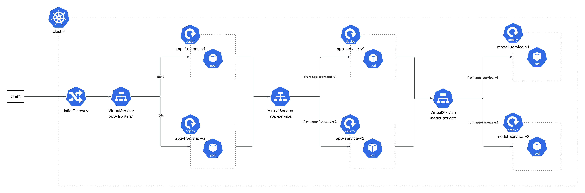

# Deployment Structure and Data Flow

This document provides a conceptual overview of our deployment architecture and data flow, focusing on the Kubernetes and Istio-based setup. It is intended to help new contributors quickly understand the system’s structure, the roles of its components, and how requests flow through the cluster. For implementation details, see the [operation repository](https://github.com/remla2025-team9/operation).

---

## 1. **High-Level Architecture**

Our deployment consists of three main application components, monitoring infrastructure, and supporting Kubernetes/Istio resources:

- **App Frontend**: User-facing web application.
- **App Service**: Backend API, mediates between frontend and model.
- **Model Service**: Serves ML model predictions.
- **Monitoring Stack**: Prometheus and Grafana for metrics and dashboards.
- **Istio Service Mesh**: Handles traffic management, security, and observability.
- **Persistent Storage**: For model cache.

**Other resources:**
- **ConfigMaps**: Grafana dashboards.
- **PersistentVolumes/Claims**: Model cache storage.
- **ServiceMonitors/PrometheusRules**: For monitoring and alerting.

---

## 2. **Deployment Structure Visualization**

This diagram illustrates the high-level architecture and data flow of our deployment, including the relationships between the app-frontend, app-service, model-service, and the Istio infrastructure.

---

## 3. **Kubernetes Resources Overview**

- **Deployments**: Each service (frontend, backend, model) is deployed as a Kubernetes Deployment, supporting multiple versions for experiments.
- **Services**: Expose each Deployment internally in the cluster.
- **PersistentVolumes/Claims**: Provide storage for model cache, ensuring model artifacts persist across pod restarts.
- **Secrets & ConfigMaps**: Store sensitive and non-sensitive configuration, injected into pods as environment variables or files.
- **Monitoring**: Prometheus and Grafana are deployed via Helm charts, with ServiceMonitors and dashboards configured for metrics collection and visualization.

---

## 4. **Istio Service Mesh Components**

- **Gateway**: Entry point for all external traffic into the cluster.
- **VirtualServices**: Define routing rules for HTTP traffic, enabling advanced traffic management.
- **DestinationRules**: Define subsets (v1, v2) for each service, enabling version-based routing and load balancing strategies.
- **EnvoyFilters**: Used for rate limiting.
- **Sidecar Injection**: All application pods have Istio sidecars enabling the service mesh.

---

## 5. **Request Flow and Dynamic Routing**

### **External Request Flow**

1. **User Request**: A user accesses the frontend via a DNS name (e.g., `app-frontend.k8s.local`).
2. **Gateway**: The request enters the cluster through the Istio Gateway.
3. **VirtualService Routing**: Istio routes the request to the appropriate frontend pod, potentially splitting traffic between versions (90% to v1, 10% to v2).
4. **Frontend to Backend**: The frontend calls the backend API (`app-service`) via its internal service name. Using VirtualServices, we ensure that the same version of the backend is used consistently for the frontend version.
5. **Backend to Model**: The backend calls the model service for predictions. The model service can also have multiple versions, and the backend uses VirtualServices to route requests to the appropriate model version.
6. **Response Propagation**: The response flows back through the same path to the user.

### **Dynamic Traffic Routing**

- **A/B Testing / Canary Releases**: VirtualServices and DestinationRules allow us to direct a percentage of traffic to different versions of a service (90% to v1, 10% to v2), enabling safe experimentation and gradual rollouts.
- **Header-Based Routing**: Some routes use HTTP headers (`x-user`) for consistent hashing, ensuring user sessions are sticky to a particular version.
- **Rate Limiting**: EnvoyFilters can enforce rate limits at the gateway level.

### **Monitoring and Observability**

- **Prometheus**: Scrapes metrics from all services and the Istio mesh.
- **Grafana**: Visualizes metrics and alerts, with dashboards for application and infrastructure health.
- **PrometheusRules**: Define alerts (e.g., high error rates, latency spikes).

---

## 6. **Experimental Design**

- **Multiple Versions**: Each service can have multiple versions (v1, v2) deployed simultaneously.
- **Traffic Splitting**: Istio VirtualServices control what percentage of traffic goes to each version, supporting controlled experiments.
- **Observability**: Metrics and dashboards allow us to monitor the impact of experiments in real time.
- **Persistence**: Model cache is shared via PersistentVolumes, ensuring consistent model state across deployments.

---
## 7. **Further Reading**

For more details, see the [operation repository](https://github.com/remla2025-team9/operation) and its [README](https://github.com/remla2025-team9/operation#readme).

---